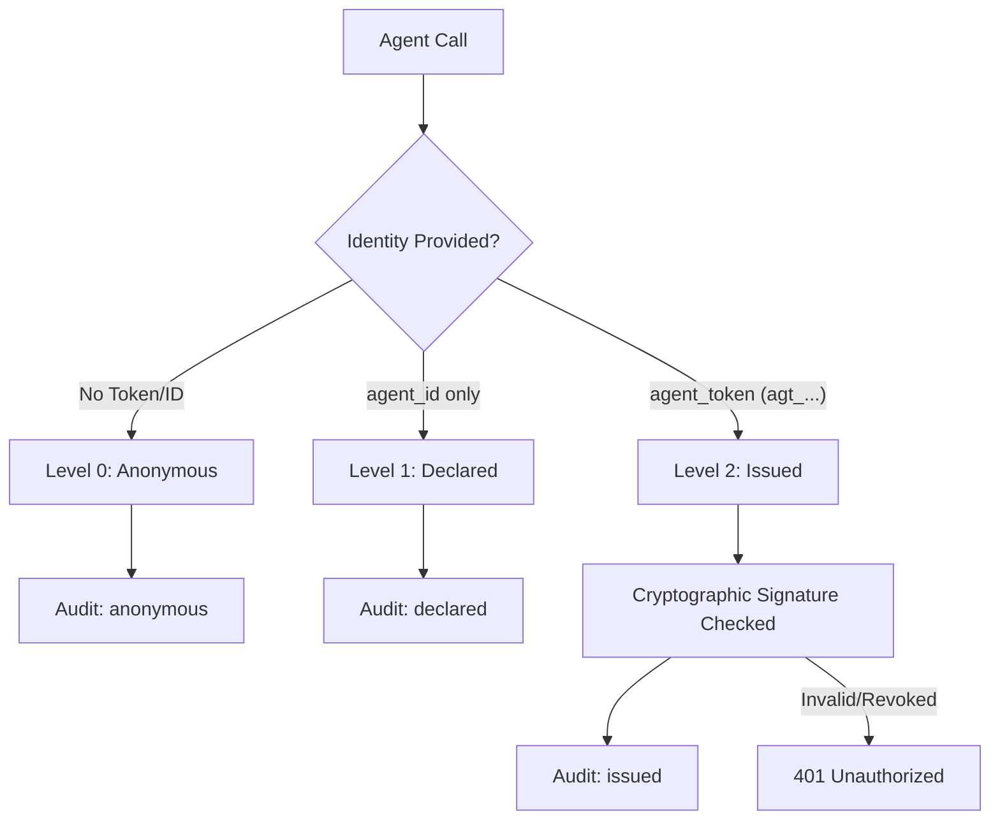

# Agent Identity Overview

In a traditional application ecosystem, credentials (like API keys) are typically injected into the application environment at startup, and the application is trusted to use them exactly as programmed. In the agentic era, however, applications are replaced by LLM-powered autonomous agents that interpret natural language, process untrusted inputs, and dynamically generate calls to external APIs. 

Because agents make decisions runtime, traditional static secret injection is insufficient. If a multi-agent system containing a researcher, writer, and executor runs simultaneously, and an unexpected credential leak or billing spike occurs, you must be able to trace *which* agent resolved the credential and *why*. 

Agent Identity provides the core infrastructure to solve this, offering fine-grained traceability, cryptographic verification, and the ability to isolate and revoke individual agents without affecting the rest of your fleet.

---

## Why identity matters for agents

Standard API key management systems treat the executing environment as a single trusted unit. This model breaks down under agentic workflows for three primary reasons:

:::step
1. **Prompt Injection Risks**: If an agent reads untrusted user content (such as parsing a webpage or scanning an email), it can be manipulated by malicious text instructions to exfiltrate secrets or make unauthorized API calls. If the executing environment shares a single flat pool of secrets, a compromised agent has access to all of them.
2. **Attribution and Diagnostics**: When running concurrent agents in pipelines or swarms (e.g., using frameworks like LangChain, CrewAI, or AutoGen), general server logs only show incoming or outgoing requests. They cannot distinguish which agent initiated which call.
3. **Least Privilege and Revocation**: If a single agent behaves unexpectedly or gets compromised, you should be able to revoke its access immediately. Without identity-based tracking, the only option is to rotate the entire environment's credentials, which causes immediate downtime for all other agents.
:::

---

## The three levels

AgentSecrets supports three levels of agent identity, balancing developer velocity with production security.

### 1. Anonymous (Level 0)
This is the default setting. Calls are made and logged without agent attribution. 
* **Mechanism**: The agent makes a request to the proxy without specifying an `agent_id` or `agent_token`.
* **Use Case**: Quick local development, prototyping, single-agent test scripts.
* **Risk**: High security risk in production. You cannot tell which agent made which call, and you cannot revoke access for one agent without disabling the entire proxy.

### 2. Declared Identity (Level 1)
Declared identity introduces basic attribution by naming agents.
* **Mechanism**: The agent self-reports its name (e.g., `billing-agent`) using the `agent_id` parameter in the SDK or the `X-AS-Agent-ID` HTTP header.
* **Use Case**: Trusted environments, multi-agent debugging, and general log filtering.
* **Risk**: No verification. Any process or agent can claim to be any name (e.g. a compromised agent could claim to be the `"billing-agent"` to bypass audit suspicion).

### 3. Issued (Cryptographic) Identity (Level 2)
Issued identity enforces cryptographic security and strong attribution.
* **Mechanism**: The agent uses a token prefixed with `agt_` issued via the Workspace CLI or dashboard. The proxy cryptographically validates the token against the workspace's public key before resolving any secrets.
* **Use Case**: Production environments, sensitive data pipelines, regulatory compliance.
* **Benefit**: Complete proof of origin. If a token is compromised, it can be revoked instantly without affecting other tokens or restarting the application.

---

## How identity flows into the audit log

When the credential proxy intercepts a call and injects a secret, it records the identity level and the agent identifier to the audit log. This entry is signed and synced to the AgentSecrets backend.

The audit log captures these details across three fields:

| Field | Anonymous | Declared | Issued |
|---|---|---|---|
| `agent_id` | `null` | `"my-agent-name"` | `"my-agent-name"` |
| `agent_identity_level` | `"anonymous"` | `"declared"` | `"issued"` |
| `token_fingerprint` | `null` | `null` | `sha256(agt_token_hash)` |

By inspecting the logs, you can quickly group, filter, or trigger alerts based on the caller's identity level.

> [NOTE]
> For issued identity, the cryptographic token fingerprint remains permanently tied to the historical logs. Even if you revoke the token or delete the agent, the history remains intact for forensic auditing.
