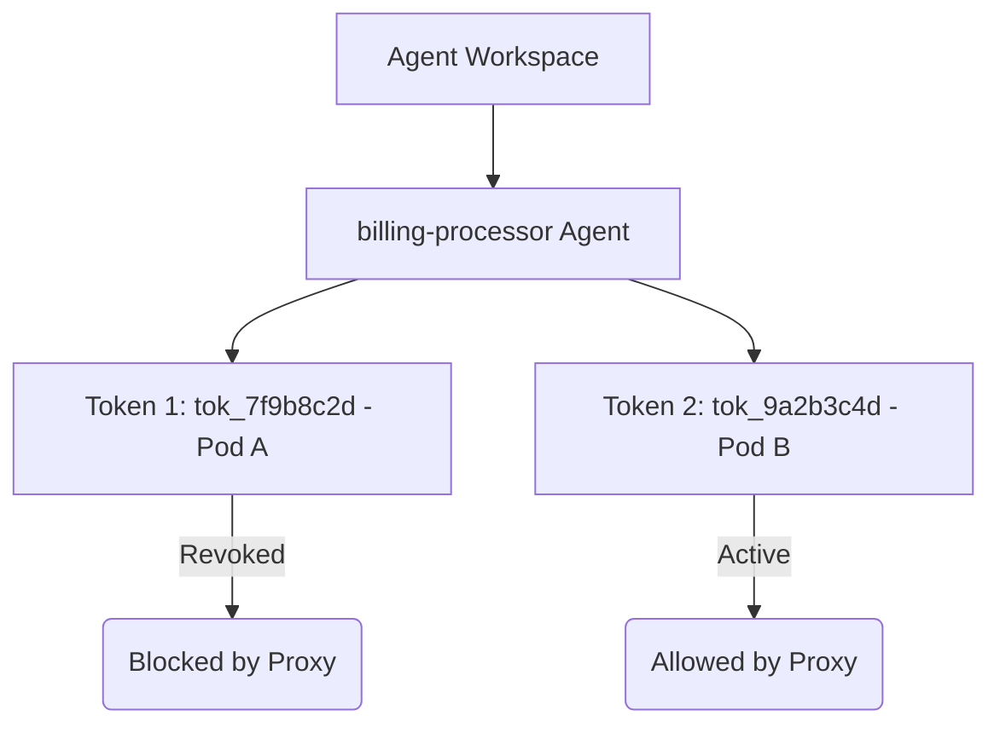

# Token Lifecycle

Managing the lifecycle of Agent Identity Tokens is critical to maintaining a secure least-privilege posture. AgentSecrets provides commands to inspect active tokens, trace when they were last used, and revoke them instantly without causing downtime for other running agents.

---

## Listing tokens per agent

You can list all tokens issued for a specific agent name to monitor active connections and track their activity.

:::step
### 1. Run the list command
Use the `agent token list` command, specifying the target agent's name:

```bash
agentsecrets agent token list "billing-processor"
```
:::

:::step
### 2. Inspect active connections
The CLI returns a table displaying metadata for all tokens associated with that agent:

```
ID            CREATED               LAST USED             STATUS
tok_7f9b8c2d  2026-05-18 10:00:00   2026-05-20 01:10:00   active
tok_9a2b3c4d  2026-05-19 12:00:00   2026-05-20 01:12:00   active
```

* **ID**: The unique, public identifier of the token (`token_id`). This ID is safe to share and is used for revocation.
* **CREATED**: The timestamp when the token was generated.
* **LAST USED**: The timestamp when the credential proxy last authenticated a request using this token.
* **STATUS**: The current state of the token (e.g., `active` or `revoked`).
:::

---

## Revoking a specific token

If a token is exposed, or if a container or VM hosting an agent is terminated, you must revoke the token immediately.

:::step
### 1. Identify the Token ID
Run `agentsecrets agent token list` to identify the ID of the token you wish to revoke (e.g., `tok_7f9b8c2d`).
:::

:::step
### 2. Execute the revocation command
Run the `revoke` command with the token ID and agent name:

```bash
agentsecrets agent token revoke tok_7f9b8c2d --agent="billing-processor"
```
:::

:::step
### 3. Verify revocation
List the tokens again to ensure the status is updated or the token is removed:

```bash
agentsecrets agent token list "billing-processor"
```

Behind the scenes, this command calls the backend REST API:
```http
DELETE /api/workspaces/{workspace_id}/agents/{registration_id}/tokens/tok_7f9b8c2d/ HTTP/1.1
Host: api.agentsecrets.com
Authorization: Bearer <user_session_jwt>
```
Once executed, the token ID is blocklisted. The proxy syncs this blocklist within seconds, and any subsequent API calls using the revoked token will fail with a `401 Unauthorized` status.
:::

---

## Revoking without touching other agents

A core design feature of AgentSecrets is **isolation**. Because agent identities are token-based, rather than relying on shared environment-wide API keys, revocation is surgical:



If you have five instances of a billing agent running across five Kubernetes pods, each pod should use its own unique agent token. 
* If Pod A is compromised, you revoke `tok_7f9b8c2d`.
* Pod A is immediately locked out of resolving secrets.
* Pods B, C, D, and E continue resolving secrets and processing transactions without interruption.
* You do not need to redeploy the other pods, change their environment variables, or rotate the root workspace secrets.

---

## Token expiry (roadmap)

Currently, agent tokens remain active indefinitely until they are explicitly revoked or the parent agent identity is deleted. To further strengthen production security, the following token lifecycle features are on the active product roadmap:

:::step
1. **Configurable TTL (Time-To-Live)**: Specify an expiration date at the time of token creation:
   ```bash
   agentsecrets agent token issue "billing-processor" --ttl 7d
   ```
2. **Automatic Rotation SDKs**: Out-of-the-box support in the SDK to dynamically exchange expiring tokens in the background without process restarts.
3. **Idle Token Auto-Deactivation**: A workspace-level policy that automatically revokes any token that has not made a call to the proxy within a configurable window (e.g., 30 days).
:::

> [NOTE]
> To implement rotation in the interim, run a cron job or background worker that generates a new token using the CLI, updates the target environment variables, and triggers a rolling restart of your agent processes.
