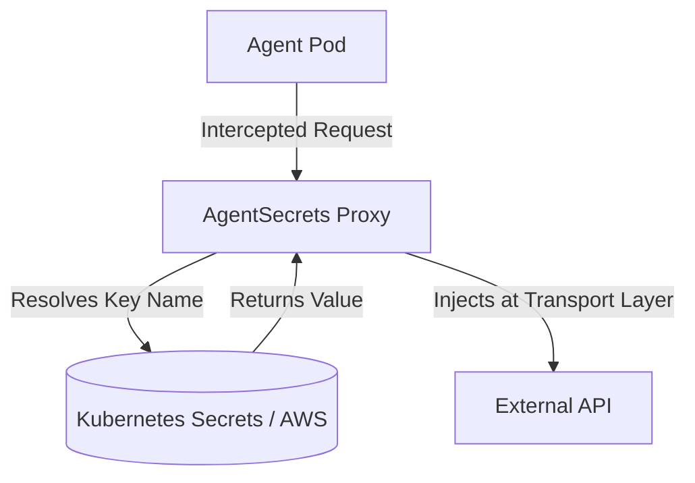

# Kubernetes Deployment

This guide covers how to deploy the AgentSecrets proxy daemon in a Kubernetes environment. 

Because AgentSecrets acts as a local security boundary that intercepts transport-layer requests, the way you deploy it in Kubernetes depends on your architecture and isolation requirements.

The two recommended deployment patterns are **Sidecar** and **DaemonSet**.

---

## 1. The Sidecar Pattern (Recommended)

Deploying the AgentSecrets proxy as a sidecar container within the same Pod as your AI agent is the recommended approach. This provides the highest level of isolation and security.

:::step
1. **Pod-Level Isolation**
   Each AI agent gets its own dedicated proxy instance. If one agent is compromised, its proxy cannot be used to inject credentials belonging to another agent.
:::

:::step
2. **Localhost Routing**
   The AI agent container routes its outbound traffic through `localhost:9090` (the proxy sidecar). Since the proxy is in the same network namespace, this traffic never leaves the Pod unencrypted.
:::

:::step
3. **IAM and Identity**
   You can bind specific Kubernetes ServiceAccounts or IAM Roles for Service Accounts (IRSA) to the Pod, ensuring the proxy only has permission to resolve secrets authorized for that specific agent identity.
:::

### Example Deployment

```yaml
apiVersion: apps/v1
kind: Deployment
metadata:
  name: ai-agent-deployment
spec:
  replicas: 3
  selector:
    matchLabels:
      app: ai-agent
  template:
    metadata:
      labels:
        app: ai-agent
    spec:
      containers:
      # The AI Agent Container
      - name: ai-agent
        image: my-registry/ai-agent:latest
        env:
        - name: HTTP_PROXY
          value: "http://localhost:9090"
        - name: HTTPS_PROXY
          value: "http://localhost:9090"

      # The AgentSecrets Proxy Sidecar
      - name: agentsecrets-proxy
        image: agentsecrets/proxy:latest
        ports:
        - containerPort: 9090
        env:
        # Bind proxy to all interfaces in the pod namespace
        - name: AGENTSECRETS_HOST
          value: "0.0.0.0"
        - name: AGENTSECRETS_PORT
          value: "9090"
```

---

## 2. The DaemonSet Pattern

For large-scale, high-density clusters where running a sidecar per pod consumes too much overhead, you can deploy the AgentSecrets proxy as a DaemonSet.

:::step
1. **Node-Level Injection**
   A single proxy instance runs on every Kubernetes node. All agent pods on that node route their traffic through the node's local proxy instance.
:::

:::step
2. **Resource Efficiency**
   This significantly reduces memory and CPU overhead in clusters running hundreds of micro-agents.
:::

:::step
3. **Security Tradeoffs**
   Because the proxy is shared across the node, you must rely on Agent Identity tokens passed in the request headers (e.g., `X-Agent-Identity`) to ensure the proxy applies the correct domain allowlists and credential scopes for the calling pod.
:::

### Configuration Notes

When using a DaemonSet, your agent pods should route traffic to the node IP. You can expose this to the pods using the Kubernetes Downward API:

```yaml
env:
- name: NODE_IP
  valueFrom:
    fieldRef:
      fieldPath: status.hostIP
- name: HTTP_PROXY
  value: "http://$(NODE_IP):9090"
```

---

## Secret Resolution in Kubernetes

AgentSecrets uses the OS Keychain by default on local machines. In a Kubernetes environment, the proxy resolves credentials from your cloud provider's native secret manager (e.g., AWS Secrets Manager, Google Secret Manager, HashiCorp Vault) or directly from native Kubernetes Secrets.

If using native Kubernetes Secrets, you can mount them as files into the proxy container or allow the proxy to use the Kubernetes API to resolve them dynamically using its ServiceAccount permissions.


