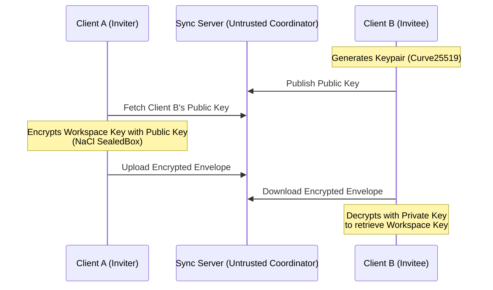
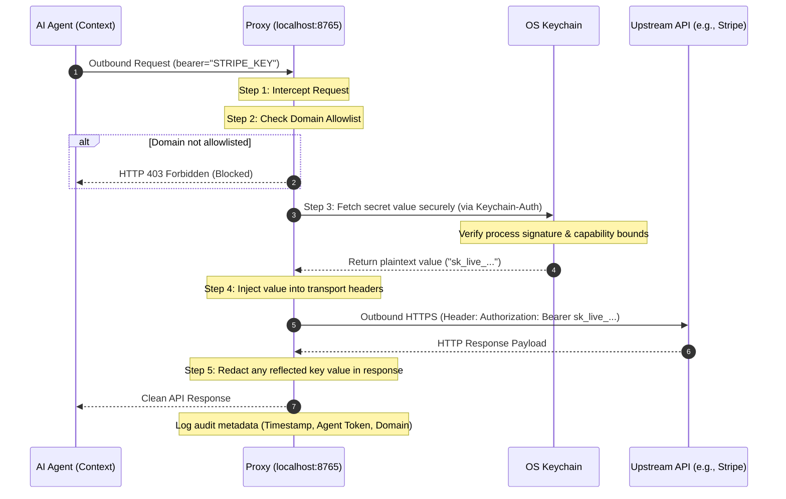

# How AgentSecrets Works

AgentSecrets is a zero-knowledge developer credential orchestrator built for the AI era. Rather than acting as a simple HTTP request proxy, it manages the complete credentials lifecycle—secure storage, environment isolation, team sharing, transport-layer injection, and auditing—for AI agents and automated workflows.

By decoupling credentials from the application runtime, AgentSecrets ensures that sensitive keys never enter the memory, context, file logs, or console output of AI agents.

---

## Core Capabilities Enabled

AgentSecrets enables developers to build and run AI agents and automated workflows with strict security boundaries:

- **Absolute Context Decoupling**: AI agents only hold key references (e.g., `STRIPE_KEY`) rather than plaintext values. This protects credentials from prompt injection attacks, context window leakage, and compromised third-party dependencies.
- **Zero-Trust Team Synchronization**: Team members can share environments and sync secrets securely without ever exposing decryption keys to the central coordination server.
- **Granular Access Control**: Credentials are bound to specific workspaces, projects, environments, and authorized domain targets.
- **Auditable Agent Execution**: Outbound calls are mapped to cryptographic agent identities, allowing you to trace which agent accessed which external API and when.

---

## Zero-Knowledge Architecture

The zero-knowledge nature of AgentSecrets is holistic: **the credential value itself is never present or visible at any point in the entire architecture**. From storage and cloud synchronization to runtime execution and transport-layer injection, the raw secret value remains completely hidden from the agent, the host application, and the sync servers.

### At-Rest Encryption & Process-Level Security

When secrets are defined locally, they are secured via your operating system keychain (macOS Keychain, Windows Credential Manager, or Linux Secret Service). Because accessing the OS keychain safely requires process-level boundaries, AgentSecrets runs a secure background daemon called `keychain-auth` to manage all cryptographic operations.

When you sync these secrets to the cloud:
1. The `keychain-auth` daemon validates the cryptographic hash of the AgentSecrets CLI binary to prevent impersonation (Anti-Impersonation).
2. Once verified, the daemon retrieves the symmetric **Workspace Key** from your OS keychain.
3. The payload is encrypted locally using **AES-256-GCM** with a key derived from the Workspace Key via **Argon2id**.
4. The resulting ciphertext blob and initialization vectors (nonce and tag) are pushed to the backend database.
5. The server wraps this base64 blob in a second layer of **Fernet** encryption at rest. Because the server does not possess the Workspace Key, it is mathematically blind to your secrets.

### Asymmetric Team Sharing

To share credentials with teammates without a centralized key custodian, AgentSecrets uses a zero-trust asymmetric key exchange (NaCl SealedBox utilizing Curve25519):

1. **Key Generation**: When team members register, their local CLI generates an asymmetric Curve25519 keypair. The private key remains locally in their keychain; the public key is uploaded to the backend.
2. **Envelope Creation**: When you invite a user to a workspace, your local CLI fetches their public key, encrypts the Workspace Key using NaCl SealedBox, and uploads the encrypted envelope to the server.
3. **Key Recovery**: When the invitee accepts the invite, their local CLI downloads the envelope and decrypts it using their private key, restoring the Workspace Key locally. The backend never has access to the private key, maintaining zero-knowledge integrity.

---

## The Proxy Call Lifecycle

The AgentSecrets proxy intercepts outgoing requests, validates them against target allowlists, and injects resolved credentials right before they hit the wire.

### 1. Request Interception

:::step
The AI agent or application sends an outbound HTTP/HTTPS request, pointing authorization headers or request bodies to a key name (e.g. `bearer="STRIPE_KEY"`). The proxy daemon (running at `localhost:8765`) intercepts this request.
:::

### 2. Pre-Execution Allowlist Check

:::step
As an additional safety net, the target host is checked against the active workspace domain allowlist. If the domain is not authorized, the proxy aborts the execution with a `403 Forbidden`, logs the blocked attempt, and stops. This prevents prompt injections from exfiltrating credentials to external hacker-controlled servers.
:::

### 3. Decryption and Anti-Impersonation

:::step
The proxy locates the workspace key, environment context, and key name. It queries the background `keychain-auth` daemon. The daemon verifies the cryptographic hash of the calling proxy process to ensure no unauthorized process is attempting to fetch secrets. Once approved, it decrypts the secret value inside the proxy daemon's private memory space. The decrypted value is never written to disk, output to standard streams, or returned to the calling agent process.
:::

### 4. Transport-Layer Injection

:::step
The decrypted credential is substituted into the request payload at the network layer. Depending on the configured injection style, it is placed in headers (e.g., `Authorization: Bearer`), URL query parameters, or JSON body fields. The request is then securely forwarded to the upstream API using TLS.
:::

### 5. Response Scanning and Redaction

:::step
Once the upstream API returns a response, the proxy scans the body. If the upstream service reflects the API key back in the payload (often found in error logs or debug fields), the proxy redacts it, replacing the token with `[REDACTED_BY_AGENTSECRETS]`.

Finally, the proxy logs the metadata of the call (timestamp, requesting agent token, environment, endpoint, response status, and duration) to the audit log. No credential values are ever saved in the logs. The redacted response is then handed to the calling agent code.
:::

---

## Outbound Access Control and Identity Scoping

To ensure complete runtime security, AgentSecrets enforces boundaries at two levels:

### Binary Anti-Impersonation (Keychain Auth)
Before any request is intercepted or keys are fetched, the local `keychain-auth` daemon verifies the cryptographic hash and execution path of the proxy making the request. This ensures that no unauthorized script or malware running locally can impersonate the legitimate proxy or CLI to extract credentials.

### Cryptographic Agent Identity

By default, AgentSecrets supports anonymous execution for simple, single-agent setups or one-off tools. However, for multi-agent workflows, you can enforce cryptographic identity attribution:
- **Anonymous Execution (Default)**: Outbound calls are permitted and logged with no agent attribution (marked as `anonymous`).
- **Cryptographic Attribution**: Every authorized agent instance is issued a cryptographic **Agent Token**. When an agent makes requests:
  - The proxy cryptographically validates the token.
  - The request is linked to the agent's identity in the audit log.
  - You can instantly revoke an individual agent's token without rotating or changing underlying workspace credentials, isolating compromises immediately.

### Environment Boundaries
Credentials are bound to environment namespaces (`development`, `staging`, `production`). The proxy enforces runtime boundaries, preventing development code from using production-level credentials, and vice versa, keeping data access segregated.
