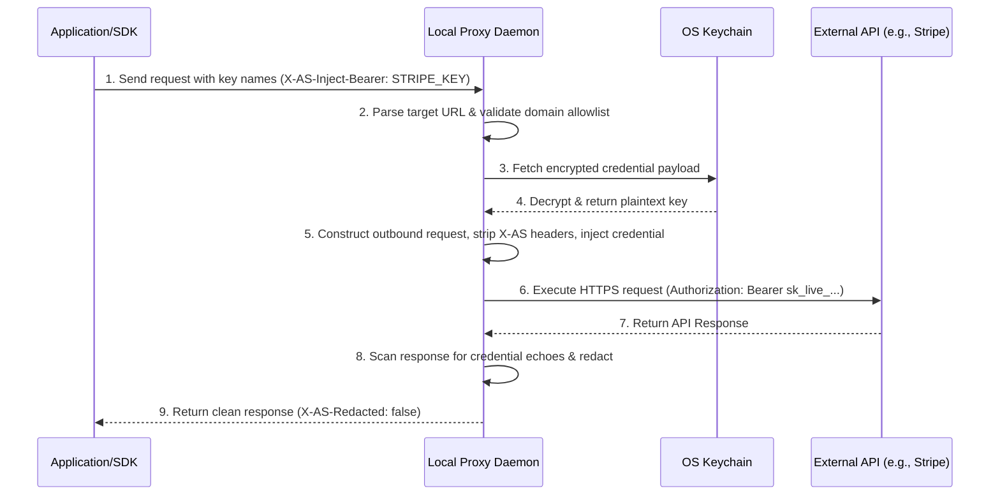

# How Credential Injection Works

AgentSecrets intercepts outbound requests at the transport layer on your local machine, keeping credentials entirely out of your application process space. This document details the step-by-step lifecycle of how a secret is resolved, injected, and audited.

---

## The per-request lifecycle

When your code or SDK makes an API call through AgentSecrets, it goes through a highly secure, multi-stage processing pipeline before the request ever hits the network.



---

## How the proxy resolves the key name

The local proxy daemon acts as a secure container. It does not load all secrets into memory at boot time. Instead, it resolves them on-demand:

:::step
1. **Header Parsing**: The proxy reads the incoming headers to extract the target key name (e.g., `STRIPE_KEY`) and the requested injection style.
2. **Context Resolution**: The proxy determines the active workspace, project, and environment by reading the `.agentsecrets/project.json` file in the directory where the calling client is running, or from the active session config.
3. **Keychain Query**: It queries the OS Keychain (macOS Keychain, Windows Credential Manager, or Linux Secret Service) for the active project-environment namespace.
4. **Hardware Decryption**: If the keychain is protected by a hardware Secure Enclave or TPM, the proxy negotiates access using the local user's cryptographic identity generated during `agentsecrets init`. The plaintext credential is materialised in memory only for the duration of the HTTP request lifecycle.
:::

---

## Injection at the transport layer

Once the plaintext secret is resolved, the proxy performs transport-layer rewriting. 

- **SSL/TLS Termination**: The local application talks to the proxy over a local HTTP connection (or a locally trust-signed HTTPS connection). The proxy terminates this connection, rewrites the request headers, and initiates a brand new, secure outbound HTTPS connection (`TLS v1.3`) to the target API endpoint.
- **Header Rewriting**: The proxy removes all `X-AS-*` control headers. It then dynamically populates the appropriate standard authentication headers (such as `Authorization`) or query parameters before transmitting the payload.
- **Volatile Memory**: Plaintext secret values are held in memory as transient byte arrays. They are immediately overwritten or garbage-collected once the outbound request socket is opened.

---

## What leaves the proxy and what does not

Understanding the security boundary is critical. Plaintext credentials never leave the boundary of your local machine.

| Data Element | In local application process | Sent to Local Proxy | Sent over Internet to Target API |
| :--- | :---: | :---: | :---: |
| Plaintext Credentials | **No** | **No** | **Yes** (via HTTPS) |
| Secret Reference Names | **Yes** | **Yes** | **No** |
| `X-AS-*` Control Headers | **Yes** | **Yes** | **No** |
| Target API Endpoints | **Yes** | **Yes** | **Yes** |
| Audit Logs | **No** | **Yes** | **Yes** (Metadata only, no values) |

---

## Annotated example request

To see exactly how this transformation looks in practice, compare the HTTP payload sent by your application to the proxy with the actual payload transmitted by the proxy to the target API.

### 1. Request from application to local proxy
Your application sends the key reference name `STRIPE_KEY` and target information:

```http
POST /proxy HTTP/1.1
Host: localhost:8765
X-AS-Target-URL: https://api.stripe.com/v1/charges
X-AS-Inject-Bearer: STRIPE_KEY
Content-Type: application/json
Content-Length: 43

{"amount": 2000, "currency": "usd"}
```

### 2. Rewritten request sent to Stripe
The proxy validates that `api.stripe.com` is on the workspace allowlist, retrieves the value for `STRIPE_KEY` (`sk_live_abc123`) from the keychain, and rewrites the request:

```http
POST /v1/charges HTTP/1.1
Host: api.stripe.com
Authorization: Bearer sk_live_abc123
Content-Type: application/json
Content-Length: 43
User-Agent: AgentSecretsProxy/1.4.0

{"amount": 2000, "currency": "usd"}
```

Notice that the `X-AS-*` headers are completely stripped, and the target server only receives a standard, authenticated API request.
