# Proxy Performance and Local Latency

Adding an intermediary proxy to your application's network path naturally raises questions about latency, memory usage, and performance overhead. 

The AgentSecrets proxy is designed from the ground up in Go/Rust to minimize request overhead, ensuring that security does not come at the expense of speed.

---

## Expected latency overhead

The local proxy introduces a loopback network hop. Because this communication occurs entirely within the host machine over the loopback interface (`127.0.0.1`), network transit time is sub-millisecond (typically **0.1ms to 0.3ms**).

The total latency profile of a proxy request is divided into three components:

:::step
1. **Local Loopback Transit**: The application sends the request to the proxy (~0.2ms).
2. **Secret Decryption**: The proxy resolves the reference name, fetches the cipher from the OS Keychain, and decrypts it. Because the decrypted keys are securely cached in the proxy daemon's RAM, this step takes **< 0.05ms** for cached keys, and **5ms to 15ms** for uncached keys requiring hardware Keychain/Secure Enclave decryptions.
3. **Outbound Transit & TLS**: The proxy opens an outbound TLS connection to the remote API.
:::

---

## Local vs remote resolution

A common misconception is that the local proxy makes a remote network call to the AgentSecrets cloud servers to resolve secrets on every API request. **It does not.**

- **Offline Decryption**: All decryption keys and credentials reside locally. Decryption is performed entirely on your local machine using your cryptographic private key.
- **Asynchronous Syncing**: The proxy synchronizes domain allowlists, project settings, and credential revocation lists with the cloud backend asynchronously in the background. This synchronization occurs out-of-band and never blocks your application's API request path.
- **Connection Reuse**: The proxy maintains persistent HTTP keep-alive connections to common API gateways (like `api.openai.com` and `api.stripe.com`), avoiding the expensive TLS handshake overhead (usually 50ms - 150ms) on subsequent calls.

---

## Benchmarks

The following benchmarks compare the latency of direct API calls against calls routed through the AgentSecrets local proxy. Testing was performed on an AWS `c6i.xlarge` instance (Ubuntu 22.04 LTS) targeting `https://api.stripe.com/v1/balance`.

| Request Type | Direct Connection | Proxy Connection | Added Overhead |
| :--- | :---: | :---: | :---: |
| **Cold Start** (No cached TLS connection) | 165.4 ms | 166.8 ms | +1.4 ms |
| **Warm Start** (Active Connection Pool) | 42.1 ms | 42.4 ms | **+0.3 ms** |
| **p95 Latency** | 48.2 ms | 48.7 ms | +0.5 ms |
| **p99 Latency** | 112.0 ms | 113.1 ms | +1.1 ms |

```mermaid
gantt
    title Request Latency Comparison (Warm Start)
    dateFormat  X
    axisFormat %s
    
    section Direct Call
    App to Stripe :active, 0, 42
    
    section Proxy Call
    App to Proxy (Loopback) :crit, 0, 1
    Decryption & Rewrite : 1, 2
    Proxy to Stripe (Pool) :active, 2, 44
    Response Redaction Scan : 44, 45
```



---

## Optimizing for high-frequency agent calls

For high-throughput applications making hundreds of API calls per minute (such as autonomous swarm agents or high-frequency trading services), you can optimize performance using the following strategies:

### 1. Enable Connection Keep-Alive
Ensure that your application's HTTP client is configured to reuse TCP connections when talking to the proxy. In Node.js, use an Agent with `keepAlive: true`. In Python, use a `requests.Session` or `httpx.AsyncClient`.

### 2. Configure Secret Memory Cache TTL
By default, the proxy caches decrypted secrets in RAM for **300 seconds** (5 minutes). If your secrets rarely change, you can extend this TTL to reduce keychain queries:

```bash
# Set cache TTL to 1 hour (3600 seconds)
export AGENTSECRETS_CACHE_TTL=3600
agentsecrets proxy start
```

### 3. Pre-warm Connection Pools
If you know your agent will make burst calls to a specific domain (e.g., OpenAI), you can configure the proxy to pre-warm connections in your configuration file `.agentsecrets/config.json`:

```json
{
  "proxy": {
    "prewarm_domains": ["api.openai.com", "api.anthropic.com"],
    "max_idle_connections": 100
  }
}
```

This keeps active TLS tunnels open to those hosts, eliminating handshake delays during the agent's first execution cycle.
