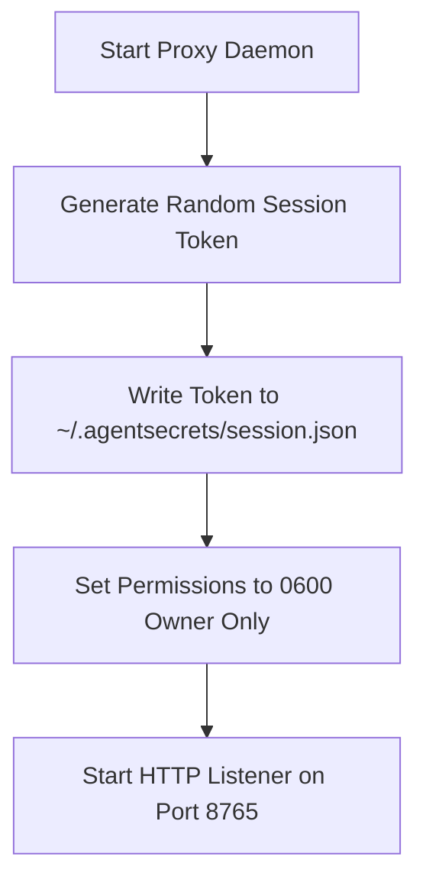

# Session Token Authentication

Because the AgentSecrets proxy daemon listens on a local port (`127.0.0.1:8765`), any running process on your machine could theoretically send requests to the proxy to resolve and inject credentials. 

To prevent unauthorized local processes, browser extensions, or other users on a shared machine from exploiting the proxy, AgentSecrets enforces **Session Token Authentication** for every incoming request.

---

## What the session token is

The session token is a cryptographically secure, high-entropy string (prefixed with `as_sess_`) generated locally by the proxy daemon. It functions as a local pre-shared key (PSK) between your application (via the SDK client) and the proxy.

Without a valid session token, the proxy rejects all requests with an `HTTP 401 Unauthorized` response before checking target domains or key names.

---

## How it is generated at proxy startup

Every time the proxy daemon starts, it generates a new session token using a cryptographically secure random number generator (CSPRNG).



### File-Level Permissions
The proxy writes the session configuration to a file in the user's home directory (e.g., `~/.agentsecrets/session.json` on macOS/Linux, or `%USERPROFILE%\.agentsecrets\session.json` on Windows).

To ensure only authorized processes can read the token, the proxy applies strict file permissions:
- **macOS/Linux**: `0600` (Owner read/write only).
- **Windows**: Access Control Lists (ACLs) restricted to the current Owner SID.

Any attempt by a process running under a different user account to read this file will be blocked by the operating system's filesystem security.

---

## Including it in requests

When making requests to the local proxy, your HTTP client must include the token in the `X-AS-Session-Token` header.

### Raw HTTP Request Example
```http
POST /proxy HTTP/1.1
Host: localhost:8765
X-AS-Session-Token: as_sess_8f9c2d1b...
X-AS-Target-URL: https://api.stripe.com/v1/balance
X-AS-Inject-Bearer: STRIPE_KEY
```

### SDK Integration
You do not need to manage the session token manually when using the official SDKs. The AgentSecrets SDK automatically:
:::step
1. Locates the session file on the local filesystem.
2. Reads the current token.
3. Injects the `X-AS-Session-Token` header into every request made through `client.call()`.
:::

---

## Why it blocks rogue processes

By combining local port binding with filesystem-protected token storage, AgentSecrets establishes a robust security boundary:

- **Browser Sandboxing**: Modern web browsers enforce Same-Origin Policy (SOP). Websites running in a user's browser cannot make arbitrary requests to `http://localhost:8765` unless CORS is explicitly enabled. The AgentSecrets proxy disables CORS by default, blocking malicious websites from probing the proxy.
- **Cross-User Protection**: On multi-user systems (like shared terminal servers or remote dev containers), other users logged into the system cannot access your proxy port. Even if they connect to port `8765`, they cannot read your `session.json` file to retrieve the required authentication token.
- **Process Isolation**: Untrusted background processes or malware running with standard user privileges cannot access the memory of your running SDK client. Since they cannot read your `session.json` file without triggering access alerts, they cannot hijack the proxy.

---

## Rotating the session token

To minimize exposure, session tokens are designed to be short-lived and easily rotated.

### Automatic Rotation
- The session token is rotated **every time the proxy daemon restarts** or system wakes up from sleep.
- If a session token file has not been accessed or updated for more than **24 hours**, the proxy automatically invalidates it and requires a client refresh.

### Manual Rotation
You can force-rotate the session token and rewrite the configuration file at any time:

```bash
agentsecrets proxy rotate-session
```

This command immediately revokes the current token in the proxy's memory, generates a new one, and overwrites the `session.json` file. Running SDK clients will automatically detect the file change, reload the new token, and continue making calls without interruption.
