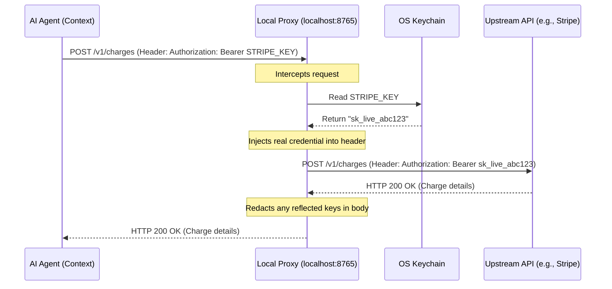

# Security Overview

AgentSecrets is built from the ground up on the principle of **Least Privilege for Artificial Intelligence**. Traditional security architectures assume that the runtime environment executing code is trusted. AI agents break this assumption because they are dynamic, interpret untrusted inputs, and are vulnerable to context leakage and prompt injection.

## The Security Model in One Page

The core guarantee of AgentSecrets is simple: **The actual value of your API credential never enters the memory, context, or logs of the AI agent.**

To achieve this, the architecture isolates credentials into three distinct layers:

:::step
1. **The AI Agent (Untrusted)**: Only holds the **key name** (e.g., `OPENAI_API_KEY`). The agent has no programmatic method to read the actual value.
2. **The Local Proxy (Trusted)**: A lightweight daemon running locally (on `localhost:8765`). It has access to your local OS Keychain (macOS Keychain, Windows Credential Manager, Linux Secret Service). It intercepts outbound requests from the agent, resolves the key name, injects the real credential into the HTTP headers at the transport layer, and forwards the request.
3. **The Synchronization Server (Zero-Knowledge)**: Stores credentials in end-to-end encrypted (E2EE) ciphertext blobs. The cloud backend never sees your plaintext secrets or your master encryption keys.
:::

---

## Security Deep Dives

To understand specific parts of our security implementation, explore the dedicated pages below:

- **[Encryption Model](/docs/security/encryption)**: Read about the AES-256-GCM, Argon2id, and ECDH protocols securing secrets at rest and in transit.
- **[Zero-Knowledge Cloud Sync](/docs/security/cloud-sync)**: Learn how team synchronization works without the central server ever gaining decryption capabilities.
- **[Proxy Security Layers](/docs/security/proxy-layers)**: Explore the TLS interception, domain allowlists, and response body redaction architecture.
- **[Threat Model](/docs/security/threat-model)**: A formal analysis of threat actors, assets, and attack vectors.
- **[Third-Party Audit Status](/docs/security/audit-status)**: Details on our upcoming and current cryptographic audits.
- **[Reporting Vulnerabilities](/docs/security/reporting)**: Our SLA and policy for responsible vulnerability disclosure.
- **[Security FAQ](/docs/security/faq)**: Answers to architectural security questions.
