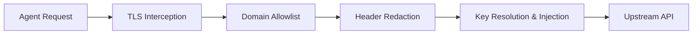

# What is AgentSecrets?

AgentSecrets is zero-knowledge secrets management and credential infrastructure for the AI era. It covers the full credentials lifecycle for AI agents and AI-assisted development workflows — storing secrets, syncing across environments and teams, detecting drift, switching environments, making authenticated API calls, auditing every call — without a credential value ever entering agent context.

> The core guarantee: the credential value is never passed to, logged by, or accessible to the AI agent at any point in the call lifecycle. Not as an argument. Not in the response. Not in the audit log.

## The problem AgentSecrets solves

Every secrets tool built before the agentic era was designed around a reasonable assumption: the application retrieving credentials is trusted. Store the credential securely, retrieve it at runtime, and use it. That model worked because applications do exactly what their code says.

AI agents are different. A coding assistant reading your codebase can also read your `.env` file. An agent deployed into production processes untrusted content and can be redirected by instructions embedded in that content — prompt injection. The moment a credential value exists anywhere in the agent's context, whether in memory, in a file it can read, or in an environment variable it can access, it is reachable.

AgentSecrets removes the value from that space entirely. The agent passes a key name. The proxy resolves the real value from the OS keychain and injects it at the transport layer. The agent receives the API response. The value existed in memory for the milliseconds required to make the HTTP request and nowhere else.

## How it fits into your stack

AgentSecrets sits directly between your AI agent (or execution environment) and the external APIs it calls. It acts as a local security boundaries layer, intercepting outbound requests, validating permission scopes, and injecting keys securely at the transport layer.

AgentSecrets provides two core execution paths depending on your workflow:

:::step
1. **The Credential Proxy (for AI Agents)**: Intercepts HTTP/HTTPS requests at the transport layer, resolving key names from the OS keychain and injecting credential values on the fly. This prevents credentials from entering the agent's context or memory.
2. **Environment Injection (for Developers & CLI Tools)**: Runs tools, scripts, or servers using `agentsecrets env -- <command>`. This injects secrets directly into the process environment variables at runtime without writing them to disk (replacing `.env` files completely).
:::

Both modes run locally, ensuring credentials never leave your machine as plaintext.

## License

MIT. The CLI, proxy, Python SDK, and MCP template are free to use, fork, and modify. See the [repository](https://github.com/The-17/agentsecrets) for the full license.

