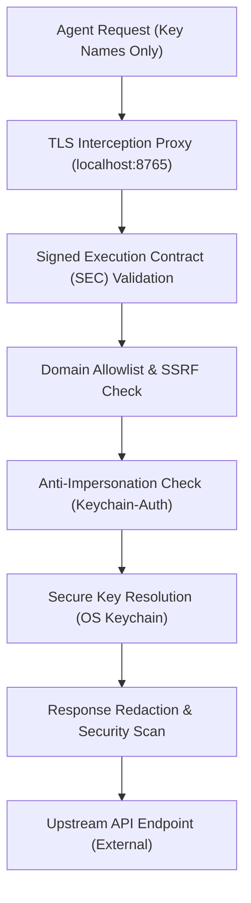

# What is AgentSecrets?

AgentSecrets is the **Zero-Knowledge Credential Infrastructure** for the AI agent era. Designed for autonomous agents, development teams, and human-in-the-loop workflows, AgentSecrets moves credentials below the application layer. It ensures that agents can execute tasks using credentials by reference (e.g., via placeholder key names) without ever holding raw credential values in memory.

Rather than a simple secrets manager or proxy, AgentSecrets serves as an **extensible security host** that compiles specialized subsystems into a unified defense-in-depth framework:

| Subsystem / Layer | System | What It Solves | Novel Claim |
|:------------------|:-------|:---------------|:------------|
| **Credential Infrastructure** | AgentSecrets (Host) | Agent credential theft & lifecycle management | Extensible zero-knowledge infrastructure: credentials are resolved and injected at runtime without agents holding secret values |
| **Intent Attestation Subsystem** | [SEC](https://github.com/The-17/SEC) | Agents misusing credentials they are allowed to access | Cryptographic pre-commitment to intent: binding API execution surfaces to pre-declared objectives |
| **Capability Bounding Subsystem** | [Keychain-Auth](https://github.com/The-17/keychain-auth) | Static, long-lived, over-privileged local credentials | OS-level keychain integration with process identity validation and dynamic session bounding |

Each subsystem represents a novel, independent security primitive. When combined, they guarantee that:
1. **Agents cannot leak credentials** because they never hold them (AgentSecrets Core).
2. **Agents cannot abuse credentials** for unauthorized actions (SEC Subsystem).
3. **Malicious processes cannot impersonate agents** to retrieve credentials (Keychain-Auth Subsystem).

---

## The Problem AgentSecrets Solves

Every secrets tool built before the agentic era was designed around a reasonable assumption: the application retrieving credentials is trusted. Store the credential securely, retrieve it at runtime, and use it. That model worked because applications do exactly what their code says.

AI agents are different. A coding assistant reading your codebase can also read your `.env` file. An agent deployed into production processes untrusted content and can be redirected by instructions embedded in that content — prompt injection. The moment a credential value exists anywhere in the agent's context, whether in memory, in a file it can read, or in an environment variable it can access, it is reachable.

AgentSecrets removes the value from that space entirely. The agent passes a key name. The infrastructure resolves the real value from the OS keychain and injects it at the transport layer. The agent receives the API response. The value existed in memory for the milliseconds required to make the HTTP request and nowhere else.

---

## Extensible Subsystem Architecture

AgentSecrets acts as a secure platform hosting modular security capabilities:

### 1. Zero-Knowledge Credential Core
Provides secure local storage (delegated to OS Keychain), client-side encrypted cloud sync, environment switching (development, staging, production), and automated response redaction to prevent secret exposure in LLM traces or logs.

### 2. Intent Attestation via SEC (Signed Execution Contracts)
Before an agent ingests untrusted data, the orchestrator signs a cryptographic contract specifying a strict natural-language objective and an allowlist of target URLs or tools. The AgentSecrets verification engine enforces this contract at the gateway, preventing hijacked agents from using valid credentials for unauthorized tasks.

### 3. Capability Bounding via Keychain-Auth
Integrates directly with the OS security layers, verifying the cryptographic hash and identity of any local process attempting to resolve secrets. It restricts credential access to explicitly authorized tools and limits sessions using time-bound capabilities.

---

## How It Fits Into Your Stack

AgentSecrets sits directly between your AI agent (or execution environment) and the external APIs it calls. It acts as the local security infrastructure, intercepting outbound requests, validating permission scopes, and injecting keys securely at the transport layer.

---

## Execution Modes

AgentSecrets provides three core execution paths depending on your workflow:

1. **The Credential Proxy (for AI Agents)**: Intercepts HTTP/HTTPS requests at the transport layer, resolving key names from the OS keychain and injecting credential values on the fly. This prevents credentials from entering the agent's context or memory.
2. **Environment Injection (for Developers & CLI Tools)**: Runs tools, scripts, or servers using `agentsecrets env -- <command>`. This injects secrets directly into the process environment variables at runtime without writing them to disk (replacing `.env` files completely).
3. **Direct CLI Calls (for Quick Tests)**: Use `agentsecrets call` to make one-shot authenticated requests from the command line. The proxy resolves the key and injects the credential for a single request without needing to start the background proxy daemon.

Both modes run locally, ensuring credentials never leave your machine as plaintext.

## License

MIT. The CLI, proxy, Python SDK, and MCP template are free to use, fork, and modify. See the [repository](https://github.com/The-17/agentsecrets) for the full license.

